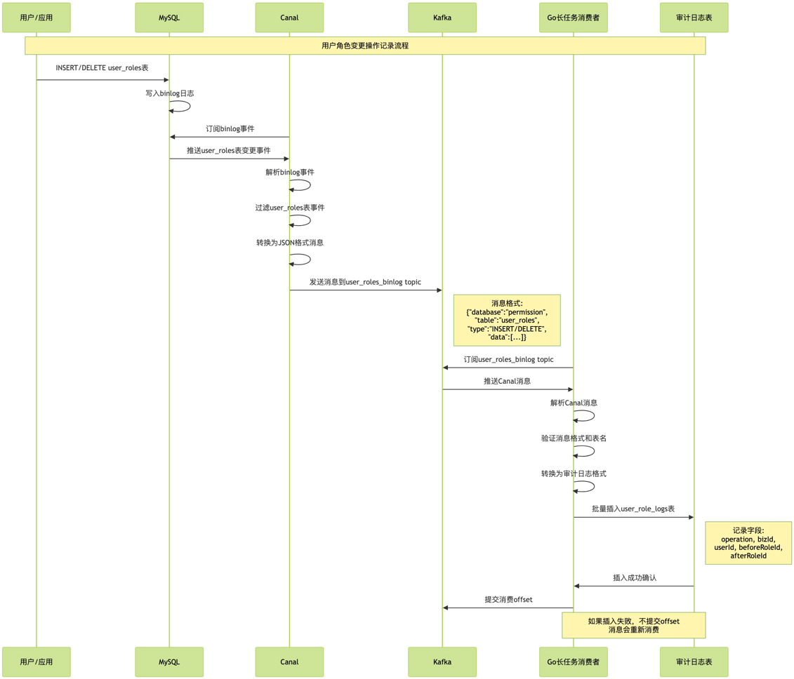

# Canal记录操作日志示例

## 1. 概述

本文档详细介绍如何使用 Canal 监听 MySQL 数据库中 `user_roles` 表的增删操作，并将这些变更事件通过 Kafka 转发到消费者服务，最终在 `user_role_logs` 表中记录操作日志。

### 架构组件
- **MySQL**: 数据源，开启 binlog 记录数据变更
- **Canal**: 阿里巴巴开源的 binlog 增量订阅和消费组件
- **Kafka**: 消息队列，用于解耦 Canal 和消费者服务
- **Go 消费者服务**: 处理 Kafka 消息并插入审计日志

### 业务场景

当系统中发生用户角色变更操作（新增或删除用户角色关系）时，需要自动记录操作日志以满足审计和追踪需求。完整时序图如下：



## 2. 相关组件的Docker配置

### 2.1 MySQL配置

在 [test_docker_compose.yaml](../scripts/test_docker_compose.yml) 中，各服务的配置、启动顺序和依赖关系至关重要：

```yaml
services:
  mysql:
    image: mysql:8.0.29
    command:
      - --default_authentication_plugin=mysql_native_password
      - --server-id=1                    # binlog 必需配置
      - --log-bin=mysql-bin              # 启用 binlog
      - --binlog-format=ROW              # ROW 格式，Canal 要求
    environment:
      MYSQL_ROOT_PASSWORD: root
    volumes:
      # 设置初始化脚本
      - ./mysql/init.sql:/docker-entrypoint-initdb.d/init.sql
    ports:
      - "13316:3306"
    healthcheck:
      test: [ "CMD", "mysqladmin", "ping", "-h", "localhost", "-u", "root", "--password=root" ]
      interval: 2s
      timeout: 5s
      retries: 15
      start_period: 10s
    networks:
      default:
```

**关键配置说明**：
- `--server-id=1`: MySQL 实例唯一标识，Canal 连接时需要
- `--log-bin=mysql-bin`: 启用 binlog，Canal 监听的基础
- `--binlog-format=ROW`: ROW 格式记录所有列的变更，适合 Canal 解析
- `healthcheck`: 确保 MySQL 完全启动后才允许其他服务连接
- 在[mysql/init.sql](../scripts/mysql/init.sql)中要添加一个专供canal使用的用户

### 2.2 Kafka 配置

```yaml
  kafka:
    image: 'bitnami/kafka:3.9.0'
    ports:
      - '9092:9092'    # 宿主机访问端口
      - '9094:9094'    # 容器内部通信端口
    environment:
      - KAFKA_CFG_NODE_ID=0
      - KAFKA_CFG_AUTO_CREATE_TOPICS_ENABLE=true
      - KAFKA_CFG_PROCESS_ROLES=controller,broker
      - KAFKA_CFG_LISTENERS=EXTERNAL://:9092,INTERNAL://:9094,CONTROLLER://:9093
      - KAFKA_CFG_ADVERTISED_LISTENERS=EXTERNAL://localhost:9092,INTERNAL://kafka:9094
      - KAFKA_CFG_INTER_BROKER_LISTENER_NAME=INTERNAL
      - KAFKA_CFG_LISTENER_SECURITY_PROTOCOL_MAP=EXTERNAL:PLAINTEXT,INTERNAL:PLAINTEXT,CONTROLLER:PLAINTEXT
      - KAFKA_CFG_CONTROLLER_QUORUM_VOTERS=0@kafka:9093
      - KAFKA_CFG_CONTROLLER_LISTENER_NAMES=CONTROLLER
    healthcheck:
      test: ["CMD-SHELL", "kafka-broker-api-versions.sh --bootstrap-server localhost:9092 || exit 1"]
      interval: 10s
      timeout: 10s
      retries: 5
      start_period: 30s
    networks:
      default:
```

**重要配置详解**：

#### 双监听器架构

Kafka配置了两套监听器来处理不同的网络访问场景：

1. **EXTERNAL监听器 (端口9092)**:
   - **用途**: 供宿主机上的应用程序访问
   - **地址**: `EXTERNAL://localhost:9092`
   - **使用场景**: 开发调试、外部消费者、管理工具等

2. **INTERNAL监听器 (端口9094)**:
   - **用途**: 供Docker容器内部的服务访问
   - **地址**: `INTERNAL://kafka:9094`
   - **使用场景**: Canal、其他微服务容器等

#### 监听器配置原理

```bash
# 监听器绑定配置
KAFKA_CFG_LISTENERS=EXTERNAL://:9092,INTERNAL://:9094,CONTROLLER://:9093
#                   ^^^^^^^^        ^^^^^^^^         ^^^^^^^^^^
#                   外部访问        内部通信         控制器通信

# 广告地址配置
KAFKA_CFG_ADVERTISED_LISTENERS=EXTERNAL://localhost:9092,INTERNAL://kafka:9094
#                              ^^^^^^^^^^^^^^^^^^^^^    ^^^^^^^^^^^^^^^^^^
#                              宿主机访问地址            容器网络访问地址
```

**为什么需要两套监听器？**

- **网络隔离**: Docker容器网络和宿主机网络是隔离的
- **地址解析**: 
  - 宿主机访问: `localhost:9092` 
  - 容器访问: `kafka:9094`（使用服务名作为主机名）
- **安全考虑**: 内外网分离，便于权限控制

### 2.3 Canal 配置

```yaml
  canal:
    image: canal/canal-server:v1.1.8
    depends_on:
      mysql:
        condition: service_healthy    # 等待 MySQL 健康检查通过
        restart: true
      kafka:
        condition: service_healthy    # 等待 Kafka 健康检查通过
        restart: true
    ports:
      - "11111:11111"
    environment:
      - CANAL_IP=canal-server   # 使用canal go客户端消费时需要，本案例中无用
      - CANAL_USER=canal        # 使用canal go客户端消费时需要，本案例中无用
      - CANAL_PASSWORD=canal    # 使用canal go客户端消费时需要，本案例中无用
      - CANAL_DESTINATIONS=permission  # 指定 Canal 实例名
    volumes:
      # 实例配置
      - ./canal/permission/instance.properties:/home/admin/canal-server/conf/permission/instance.properties
      # canal自身配置
      - ./canal/canal.properties:/home/admin/canal-server/conf/canal.properties
```

**配置技巧**：
- `depends_on` 配置确保 Canal 在 MySQL 和 Kafka 完全启动后再启动
- `condition: service_healthy` 比简单的 `depends_on` 更可靠
- `restart: true` 确保依赖服务重启时 Canal 也会重启

**注意事项**:
- `./canal/canal.properties:/home/admin/canal-server/conf/canal.properties`一定要映射到`canal.properties`而不是`instance.properties`否则会出问题，且很难找到具体的报错信息。

## 3. Canal配置详解

### 3.1 主配置文件 (canal.properties)

Canal 的主配置文件包含全局设置：

```properties
# 服务模式配置
canal.serverMode = kafka                    # 使用 Kafka 模式

# Kafka 连接配置
kafka.bootstrap.servers = kafka:9094        # 使用INTERNAL监听器
kafka.acks = all                           # 确保消息可靠性
kafka.compression.type = none               # 不压缩，便于调试
kafka.retries = 0                          # 重试次数

# 实例配置
canal.destinations = permission             # 定义实例名称列表
canal.auto.scan = true                     # 自动扫描实例配置变更
canal.auto.scan.interval = 5               # 扫描间隔（秒）

# 消息格式配置
canal.mq.flatMessage = true                # 使用扁平消息格式
canal.mq.canalBatchSize = 50              # 批量大小
canal.mq.send.thread.size = 30            # 发送线程数
```

**重要参数说明**：
- `serverMode = kafka`: 指定 Canal 以 Kafka 模式运行，直接将 binlog 事件发送到 Kafka
- `flatMessage = true`: 消息格式更简洁，便于消费者解析
- `destinations`: 定义 Canal 实例，每个实例对应一个数据库或表集合
- `kafka.bootstrap.servers = kafka:9094`: Canal容器和Kafka容器在同一个Docker网络中，使用服务名 `kafka` 作为主机名，端口 `9094` 对应INTERNAL监听器。如果错误地使用 `localhost:9092`，Canal将无法连接到Kafka。

### 3.2 实例配置文件 (permission/instance.properties)

实例配置文件定义具体的监听规则：

```properties
# MySQL 连接配置
canal.instance.master.address=mysql:3306    # MySQL 地址
canal.instance.dbUsername=canal             # 数据库用户名
canal.instance.dbPassword=canal             # 数据库密码
canal.instance.connectionCharset = UTF-8    # 连接字符集

# 表过滤配置
canal.instance.filter.regex=permission\\.user_roles  # 只监听 user_roles 表
canal.instance.filter.black.regex=mysql\\.slave_.*   # 排除系统表

# Kafka Topic 配置
canal.mq.topic=user_roles_binlog            # 指定 Kafka topic 名称
canal.mq.partition=0                        # 分区配置
```

**核心配置解释**：
1. **MYSQL数据库在容器网络中的地址**
   - `canal.instance.master.address=mysql:3306`，一定是容器名+容器网络中监听的地址。
2. **使用Canal专用的账号**
   - `canal.instance.dbUsername=canal  # 数据库用户名` 
   - `canal.instance.dbPassword=canal  # 数据库密码`
3. **表过滤 (`filter.regex`)**:
   - `permission\\.user_roles`: 只监听 permission 数据库的 user_roles 表
   - 使用正则表达式，`\\.` 转义点号
4. **黑名单过滤 (`filter.black.regex`)**:
   - 排除 MySQL 系统相关表，避免无用的监听
5. **Topic 配置**:
   - `canal.mq.topic`: 指定消息发送到的Kafka的`user_roles_binlog`topic
   - 与消费者订阅的 topic 即[config.yaml](../config/config.yaml)中`userRoleBinlogEvent.topic`保持一致

## 4. 消费者代码分析

### 4.1 消息结构

Canal 发送的消息格式在[canalx/kafka.go](../internal/pkg/canalx/kafka.go) 中，定义如下：

```go
type Message[T any] struct {
    Database string    `json:"database"`  // 数据库名
    Table    string    `json:"table"`     // 表名
    Type     string    `json:"type"`      // 操作类型：INSERT/UPDATE/DELETE
    Data     []T       `json:"data"`      // 变更数据
}
```

### 4.2 消费者核心逻辑

简化代码如下，完整代码在 [consumer.go](../internal/event/audit/consumer.go)中。

```go
func (c *UserRoleBinlogEventConsumer) Consume(ctx context.Context) error {
    // 1. 读取 Kafka 消息
    msg, err := c.consumer.ReadMessage(-1)
    if err != nil {
        return fmt.Errorf("获取消息失败: %w", err)
    }

    // 2. 解析 Canal 消息
    var evt canalx.Message[dao.UserRole]
    err = json.Unmarshal(msg.Value, &evt)
    if err != nil {
        c.logger.Warn("解析消息失败", elog.FieldErr(err))
        return err
    }

    // 3. 过滤无关消息
    if evt.Table != evt.Data[0].TableName() ||
        (evt.Type != "INSERT" && evt.Type != "DELETE") {
        return nil
    }

    // 4. 转换为审计日志格式
    err = c.dao.BatchCreate(ctx, slice.Map(evt.Data, func(_ int, src dao.UserRole) auditdao.UserRoleLog {
        var beforeRoleID, afterRoleID int64
        if evt.Type == "INSERT" {
            afterRoleID = src.RoleID
        } else if evt.Type == "DELETE" {
            beforeRoleID = src.RoleID
        }
        return auditdao.UserRoleLog{
            Operation:    evt.Type,
            BizID:        src.BizID,
            UserID:       src.UserID,
            BeforeRoleID: beforeRoleID,
            AfterRoleID:  afterRoleID,
        }
    }))

    // 5. 提交消费进度
    _, err = c.consumer.CommitMessage(msg)
    return err
}
```

**处理逻辑说明**：
1. **消息过滤**: 只处理 `user_roles` 表的 INSERT 和 DELETE 操作
2. **数据转换**: 将 Canal 格式转换为审计日志格式
3. **批量插入**: 使用 `BatchCreate` 提高性能
4. **手动提交**: 确保消息处理完成后再提交 offset

### 4.3 消费者配置信息

需要 [config.yaml](../config/config.yaml)中的如下相关配置：

```yaml
kafka:
  addr: "localhost:9092"                    # Kafka 地址

userRoleBinlogEvent:
  topic: "user_roles_binlog"               # Canal 发送的 topic
  consumer:
    groupId: "user_roles_binlog_consumer_group"  # 消费者组ID
```

**配置要点**：
- `topic` 必须与 Canal 实例配置中的 `canal.mq.topic` 一致
- `groupId` 用于 Kafka 消费者组管理，支持多实例部署

## 5. 部署和运行

### 5.1 启动Docker服务及权限平台（含消费者长任务）

```bash
   make run_platform 
```

《图片待补充》

看到如下错误消息，说明启动成功:

```log
2025-05-28 21:30:08     ERROR   runtime/asm_amd64.s:1700        消费用户权限Binlog事件失败                      {"error": "获取消息失败: Subscribed topic not available: user_roles_binlog: Broker: n topic or partition"}
```

### 5.2 验证配置

1. 登录到MySQL容器内部
```bash
docker exec -it $(docker ps -q -f name=mysql) mysql -u root -proot
```
2. 执行如下验证流程：

```mysql
-- sh-4.4# mysql -u root -proot
mysql> use permission;
Reading table information for completion of table and column names
You can turn off this feature to get a quicker startup with -A

Database changed

-- 1. 初始只有默认角色
mysql> select * from user_roles;
+----+--------+---------+---------+---------------+---------------+---------------+---------------+---------------+---------------+
| id | biz_id | user_id | role_id | role_name     | role_type     | start_time    | end_time      | ctime         | utime         |
+----+--------+---------+---------+---------------+---------------+---------------+---------------+---------------+---------------+
|  1 |      1 |     999 |       1 | ????????????? | admin_account | 1747542224165 | 4903215824165 | 1747542224165 | 1747542224165 |
+----+--------+---------+---------+---------------+---------------+---------------+---------------+---------------+---------------+
1 row in set (0.00 sec)

-- 2. 无操作日志记录 
mysql> select * from user_role_logs;
Empty set (0.00 sec)

-- 3. 向`user_roles`表中插入测试数据 
mysql> INSERT INTO `permission`.`user_roles` (biz_id, user_id, role_id, role_name, role_type, start_time, end_time, ctime, utime) VALUES (13, 1002, 111, 'Test After Restart', 'test_type2', UNIX_TIMESTAMP() * 1000, (UNIX_TIMESTAMP() + 3600*24*30) * 1000, UNIX_TIMESTAMP() * 1000, UNIX_TIMESTAMP() * 1000);
Query OK, 1 row affected (0.00 sec)

mysql> select * from user_roles;
+----+--------+---------+---------+--------------------+---------------+---------------+---------------+---------------+---------------+
| id | biz_id | user_id | role_id | role_name          | role_type     | start_time    | end_time      | ctime         | utime         |
+----+--------+---------+---------+--------------------+---------------+---------------+---------------+---------------+---------------+
|  1 |      1 |     999 |       1 | ?????????????      | admin_account | 1747542224165 | 4903215824165 | 1747542224165 | 1747542224165 |
|  2 |     13 |    1002 |     111 | Test After Restart | test_type2    | 1748439514000 | 1751031514000 | 1748439514000 | 1748439514000 |
+----+--------+---------+---------+--------------------+---------------+---------------+---------------+---------------+---------------+
2 rows in set (0.00 sec)

-- 4. 查看操作日志记录发现新增一条关于”INSERT“的操作日志记录
mysql> select * from user_role_logs;
+----+-----------+--------+---------+----------------+---------------+---------------+---------------+
| id | operation | biz_id | user_id | before_role_id | after_role_id | ctime         | utime         |
+----+-----------+--------+---------+----------------+---------------+---------------+---------------+
|  1 | INSERT    |     13 |    1002 |              0 |           111 | 1748439518449 | 1748439518449 |
+----+-----------+--------+---------+----------------+---------------+---------------+---------------+
1 row in set (0.00 sec)

-- 5. 从`user_roles`表中删除刚刚插入的测试数据 
mysql> DELETE FROM `permission`.`user_roles` WHERE `id` = 2;
Query OK, 1 row affected (0.01 sec)

mysql> select * from user_roles;
+----+--------+---------+---------+---------------+---------------+---------------+---------------+---------------+---------------+
| id | biz_id | user_id | role_id | role_name     | role_type     | start_time    | end_time      | ctime         | utime         |
+----+--------+---------+---------+---------------+---------------+---------------+---------------+---------------+---------------+
|  1 |      1 |     999 |       1 | ????????????? | admin_account | 1747542224165 | 4903215824165 | 1747542224165 | 1747542224165 |
+----+--------+---------+---------+---------------+---------------+---------------+---------------+---------------+---------------+
1 row in set (0.00 sec)

-- 6. 查看操作日志记录发现有新增一条关于”DELETE“的操作日志记录
mysql> select * from user_role_logs;
+----+-----------+--------+---------+----------------+---------------+---------------+---------------+
| id | operation | biz_id | user_id | before_role_id | after_role_id | ctime         | utime         |
+----+-----------+--------+---------+----------------+---------------+---------------+---------------+
|  1 | INSERT    |     13 |    1002 |              0 |           111 | 1748439518449 | 1748439518449 |
|  2 | DELETE    |     13 |    1002 |            111 |             0 | 1748439532918 | 1748439532918 |
+----+-----------+--------+---------+----------------+---------------+---------------+---------------+
2 rows in set (0.00 sec)
```

并在控制台看到如下log消息：
```log
2025-05-28 21:38:38     INFO    log/log.go:49   执行GORM SQL成功                        {"type": "CREATE", "table": "user_role_logs", "sql": "/* tid=46b4b86413ce3be3606d023d1208ad1a */ INSERT INTO `user_role_logs` (`operation`,`biz_id`,`user_id`,`before_role_id`,`after_role_id`,`ctime`,`utime`) VALUES ('INSERT',13,1002,0,111,1748439518449,1748439518449)"}
2025-05-28 21:38:52     INFO    log/log.go:49   执行GORM SQL成功                        {"type": "CREATE", "table": "user_role_logs", "sql": "/* tid=e479cca4018d177f6b0024d967f6cdb8 */ INSERT INTO `user_role_logs` (`operation`,`biz_id`,`user_id`,`before_role_id`,`after_role_id`,`ctime`,`utime`) VALUES ('DELETE',13,1002,111,0,1748439532918,1748439532918)"}
```

## 6. 注意事项

1. **MySQL用户权限**: Canal用户需要 `REPLICATION SLAVE` 和 `REPLICATION CLIENT` 权限
2. **网络配置**: 确保Canal能访问MySQL和Kafka的内部网络地址
3. **消息重复**: 消费者应实现幂等性处理，避免重复插入审计日志
4. **性能调优**: 根据数据量调整Canal和Kafka的批处理参数
