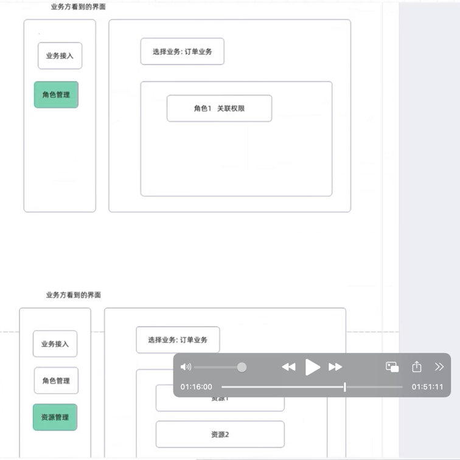

# 1. "权限平台管理后台"业务接入，user_id = 999,

## 1.1 在BusinessConfig表中，使用owner_id = user_id = 999, name = "权限平台管理后台", 创建业务配置，获取ID=1，BizID=1

| ID | BizID | OwnerID | OwnerType | Name | Code | RateLimit | Ctime | Utime |
|----|-------|---------|-----------|------|------|-----------|-------|-------|
| 1 | 1 | 999 | organization | 权限平台管理后台 | permission_platform | 5000 | 1647302400 | 1647302400 |

## 1.2 在 Resource 表中建立"权限平台管理后台“业务所属资源

type = system_table, name = 表名，这个在代码中作为常量，当用户登录”权限平台管理后台“后，执行CRUD前需要
`PermissionService.Check(ctx, user_id = 999,bizID = PermissionPlatformBizID = 1, resource_key = "business_configs", action = "create")` 验证。

| ID | BizID | Type | Key | Name | Description | Metadata | Ctime | Utime |
|----|-------|------|-----|------|-------------|----------|-------|-------|
| 1 | 1 | system_table | business_configs | 业务配置表 | 系统业务配置管理表 | {} | 1647302400 | 1647302400 |
| 2 | 1 | system_table | resources | 资源表 | 系统资源管理表 | {} | 1647302400 | 1647302400 |
| 3 | 1 | system_table | permissions | 权限表 | 系统权限管理表 | {} | 1647302400 | 1647302400 |
| 4 | 1 | system_table | roles | 角色表 | 系统角色管理表 | {} | 1647302400 | 1647302400 |
| 5 | 1 | system_table | role_inclusions | 角色包含关系表 | 系统角色包含关系管理表 | {} | 1647302400 | 1647302400 |
| 6 | 1 | system_table | role_permissions | 角色权限关联表 | 系统角色权限关联管理表 | {} | 1647302400 | 1647302400 |
| 7 | 1 | system_table | user_roles | 用户角色关联表 | 系统用户角色关联管理表 | {} | 1647302400 | 1647302400 |
| 8 | 1 | system_table | user_permissions | 用户权限关联表 | 系统用户权限关联管理表 | {} | 1647302400 | 1647302400 |

## 1.3 在 Permission 表中分别为"权限平台管理后台“业务所属资源建立权限，每张表都要有CRUD权限

| ID | BizID | Name | Description | ResourceID | ResourceType | ResourceKey | Action | Metadata | Ctime | Utime |
|----|-------|------|-------------|------------|--------------|-------------|--------|----------|-------|-------|
| 1 | 1 | 业务配置表-创建 | 创建业务配置 | 1 | system_table | business_configs | create | {} | 1647302400 | 1647302400 |
| 2 | 1 | 业务配置表-读取 | 读取业务配置 | 1 | system_table | business_configs | read | {} | 1647302400 | 1647302400 |
| 3 | 1 | 业务配置表-更新 | 更新业务配置 | 1 | system_table | business_configs | update | {} | 1647302400 | 1647302400 |
| 4 | 1 | 业务配置表-删除 | 删除业务配置 | 1 | system_table | business_configs | delete | {} | 1647302400 | 1647302400 |
| 5 | 1 | 资源表-创建 | 创建资源 | 2 | system_table | resources | create | {} | 1647302400 | 1647302400 |
| 6 | 1 | 资源表-读取 | 读取资源 | 2 | system_table | resources | read | {} | 1647302400 | 1647302400 |
| 7 | 1 | 资源表-更新 | 更新资源 | 2 | system_table | resources | update | {} | 1647302400 | 1647302400 |
| 8 | 1 | 资源表-删除 | 删除资源 | 2 | system_table | resources | delete | {} | 1647302400 | 1647302400 |
| 9 | 1 | 权限表-创建 | 创建权限 | 3 | system_table | permissions | create | {} | 1647302400 | 1647302400 |
| 10 | 1 | 权限表-读取 | 读取权限 | 3 | system_table | permissions | read | {} | 1647302400 | 1647302400 |
| 11 | 1 | 权限表-更新 | 更新权限 | 3 | system_table | permissions | update | {} | 1647302400 | 1647302400 |
| 12 | 1 | 权限表-删除 | 删除权限 | 3 | system_table | permissions | delete | {} | 1647302400 | 1647302400 |
| 13 | 1 | 角色表-创建 | 创建角色 | 4 | system_table | roles | create | {} | 1647302400 | 1647302400 |
| 14 | 1 | 角色表-读取 | 读取角色 | 4 | system_table | roles | read | {} | 1647302400 | 1647302400 |
| 15 | 1 | 角色表-更新 | 更新角色 | 4 | system_table | roles | update | {} | 1647302400 | 1647302400 |
| 16 | 1 | 角色表-删除 | 删除角色 | 4 | system_table | roles | delete | {} | 1647302400 | 1647302400 |
| 17 | 1 | 角色包含关系表-创建 | 创建角色包含关系 | 5 | system_table | role_inclusions | create | {} | 1647302400 | 1647302400 |
| 18 | 1 | 角色包含关系表-读取 | 读取角色包含关系 | 5 | system_table | role_inclusions | read | {} | 1647302400 | 1647302400 |
| 19 | 1 | 角色包含关系表-更新 | 更新角色包含关系 | 5 | system_table | role_inclusions | update | {} | 1647302400 | 1647302400 |
| 20 | 1 | 角色包含关系表-删除 | 删除角色包含关系 | 5 | system_table | role_inclusions | delete | {} | 1647302400 | 1647302400 |
| 21 | 1 | 角色权限关联表-创建 | 创建角色权限关联 | 6 | system_table | role_permissions | create | {} | 1647302400 | 1647302400 |
| 22 | 1 | 角色权限关联表-读取 | 读取角色权限关联 | 6 | system_table | role_permissions | read | {} | 1647302400 | 1647302400 |
| 23 | 1 | 角色权限关联表-更新 | 更新角色权限关联 | 6 | system_table | role_permissions | update | {} | 1647302400 | 1647302400 |
| 24 | 1 | 角色权限关联表-删除 | 删除角色权限关联 | 6 | system_table | role_permissions | delete | {} | 1647302400 | 1647302400 |
| 25 | 1 | 用户角色关联表-创建 | 创建用户角色关联 | 7 | system_table | user_roles | create | {} | 1647302400 | 1647302400 |
| 26 | 1 | 用户角色关联表-读取 | 读取用户角色关联 | 7 | system_table | user_roles | read | {} | 1647302400 | 1647302400 |
| 27 | 1 | 用户角色关联表-更新 | 更新用户角色关联 | 7 | system_table | user_roles | update | {} | 1647302400 | 1647302400 |
| 28 | 1 | 用户角色关联表-删除 | 删除用户角色关联 | 7 | system_table | user_roles | delete | {} | 1647302400 | 1647302400 |
| 29 | 1 | 用户权限关联表-创建 | 创建用户权限关联 | 8 | system_table | user_permissions | create | {} | 1647302400 | 1647302400 |
| 30 | 1 | 用户权限关联表-读取 | 读取用户权限关联 | 8 | system_table | user_permissions | read | {} | 1647302400 | 1647302400 |
| 31 | 1 | 用户权限关联表-更新 | 更新用户权限关联 | 8 | system_table | user_permissions | update | {} | 1647302400 | 1647302400 |
| 32 | 1 | 用户权限关联表-删除 | 删除用户权限关联 | 8 | system_table | user_permissions | delete | {} | 1647302400 | 1647302400 |

## 1.4 在 Role 表中建立三个type = system 的角色，名字分别是 "权限平台管理后台-系统管理员"，"权限平台管理后台-业务方管理员"， "权限平台管理后台-业务管理员"

| ID | BizID | Type | Name | Description | Metadata | StartTime | EndTime | Ctime | Utime |
|----|-------|------|------|-------------|----------|-----------|---------|-------|-------|
| 1 | 1 | system | 权限平台管理后台-系统管理员 | 拥有所有权限的顶级管理员 | {} | 1647302400 | 4102415999 | 1647302400 | 1647302400 |
| 2 | 1 | system | 权限平台管理后台-业务方管理员 | 管理特定业务及其子业务的管理员 | {} | 1647302400 | 4102415999 | 1647302400 | 1647302400 |
| 3 | 1 | system | 权限平台管理后台-业务管理员 | 仅管理特定业务的管理员 | {} | 1647302400 | 4102415999 | 1647302400 | 1647302400 |

## 1.5 在 RoleInclusion 表中，建立包换关系 —— "权限平台管理后台-系统管理员" 包含 "权限平台管理后台-业务方管理员"、"权限平台管理后台-业务管理员"，以及 "权限平台管理后台-业务方管理员" 包含 "权限平台管理后台-业务管理员"

| ID | BizID | IncludingRoleID | IncludingRoleType | IncludingRoleName | IncludedRoleID | IncludedRoleType | IncludedRoleName | Ctime | Utime |
|----|-------|-----------------|-------------------|-------------------|----------------|-----------------|-----------------|-------|-------|
| 1  | 1 | 1 | system | 权限平台管理后台-系统管理员 | 2 | system | 权限平台管理后台-业务方管理员 | 1647302400 | 1647302400 |
| 2  | 1 | 2 | system | 权限平台管理后台-业务方管理员 | 3 | system | 权限平台管理后台-业务管理员 | 1647302400 | 1647302400 |

## 1.6 在 RolePermission 表中，为"权限平台管理后台-系统管理员"授予全部表的CRUD权限，为"权限平台管理后台-业务方管理员"授予全部表，但仅限biz=其BizID或者其创建的子biz的行集合的CRUD权限， 为"权限平台管理后台-业务管理员"授予全部表，但仅限biz=其BizID的行集合的CRUD权限

此处涉及要讨论的”行过滤“问题，系统管理员可以访问全部行，业务方管理员，可以访问其对应的BizID以及其接入的子BizID所对应的行集合。而业务管理员只能访问其自己BizID对应的行。

是否在步骤1.3中权限表的PermissionMetadata中添加行过滤信息，下面这表格有问题。 ”权限平台管理后台-业务方管理员"的包含行过滤要求的规则无法表达。

| ID | BizID | RoleID | PermissionID | RoleName | RoleType | ResourceType | ResourceKey | Action | Ctime | Utime |
|----|-------|--------|--------------|----------|----------|--------------|-------------|--------|-------|-------|
| 1 | 1 | 1 | 1 | 权限平台管理后台-系统管理员 | system | system_table | business_configs | create | 1647302400 | 1647302400 |
| 2 | 1 | 1 | 2 | 权限平台管理后台-系统管理员 | system | system_table | business_configs | read | 1647302400 | 1647302400 |
| 3 | 1 | 1 | 3 | 权限平台管理后台-系统管理员 | system | system_table | business_configs | update | 1647302400 | 1647302400 |
| 4 | 1 | 1 | 4 | 权限平台管理后台-系统管理员 | system | system_table | business_configs | delete | 1647302400 | 1647302400 |
| 5 | 1 | 1 | 5 | 权限平台管理后台-系统管理员 | system | system_table | resources | create | 1647302400 | 1647302400 |
| 6 | 1 | 1 | 6 | 权限平台管理后台-系统管理员 | system | system_table | resources | read | 1647302400 | 1647302400 |
| 7 | 1 | 1 | 7 | 权限平台管理后台-系统管理员 | system | system_table | resources | update | 1647302400 | 1647302400 |
| 8 | 1 | 1 | 8 | 权限平台管理后台-系统管理员 | system | system_table | resources | delete | 1647302400 | 1647302400 |
| 9 | 1 | 1 | 9 | 权限平台管理后台-系统管理员 | system | system_table | permissions | create | 1647302400 | 1647302400 |
| 10 | 1 | 1 | 10 | 权限平台管理后台-系统管理员 | system | system_table | permissions | read | 1647302400 | 1647302400 |
| 11 | 1 | 1 | 11 | 权限平台管理后台-系统管理员 | system | system_table | permissions | update | 1647302400 | 1647302400 |
| 12 | 1 | 1 | 12 | 权限平台管理后台-系统管理员 | system | system_table | permissions | delete | 1647302400 | 1647302400 |
| 13 | 1 | 1 | 13 | 权限平台管理后台-系统管理员 | system | system_table | roles | create | 1647302400 | 1647302400 |
| 14 | 1 | 1 | 14 | 权限平台管理后台-系统管理员 | system | system_table | roles | read | 1647302400 | 1647302400 |
| 15 | 1 | 1 | 15 | 权限平台管理后台-系统管理员 | system | system_table | roles | update | 1647302400 | 1647302400 |
| 16 | 1 | 1 | 16 | 权限平台管理后台-系统管理员 | system | system_table | roles | delete | 1647302400 | 1647302400 |
| 17 | 1 | 1 | 17 | 权限平台管理后台-系统管理员 | system | system_table | role_inclusions | create | 1647302400 | 1647302400 |
| 18 | 1 | 1 | 18 | 权限平台管理后台-系统管理员 | system | system_table | role_inclusions | read | 1647302400 | 1647302400 |
| 19 | 1 | 1 | 19 | 权限平台管理后台-系统管理员 | system | system_table | role_inclusions | update | 1647302400 | 1647302400 |
| 20 | 1 | 1 | 20 | 权限平台管理后台-系统管理员 | system | system_table | role_inclusions | delete | 1647302400 | 1647302400 |
| 21 | 1 | 1 | 21 | 权限平台管理后台-系统管理员 | system | system_table | role_permissions | create | 1647302400 | 1647302400 |
| 22 | 1 | 1 | 22 | 权限平台管理后台-系统管理员 | system | system_table | role_permissions | read | 1647302400 | 1647302400 |
| 23 | 1 | 1 | 23 | 权限平台管理后台-系统管理员 | system | system_table | role_permissions | update | 1647302400 | 1647302400 |
| 24 | 1 | 1 | 24 | 权限平台管理后台-系统管理员 | system | system_table | role_permissions | delete | 1647302400 | 1647302400 |
| 25 | 1 | 1 | 25 | 权限平台管理后台-系统管理员 | system | system_table | user_roles | create | 1647302400 | 1647302400 |
| 26 | 1 | 1 | 26 | 权限平台管理后台-系统管理员 | system | system_table | user_roles | read | 1647302400 | 1647302400 |
| 27 | 1 | 1 | 27 | 权限平台管理后台-系统管理员 | system | system_table | user_roles | update | 1647302400 | 1647302400 |
| 28 | 1 | 1 | 28 | 权限平台管理后台-系统管理员 | system | system_table | user_roles | delete | 1647302400 | 1647302400 |
| 29 | 1 | 1 | 29 | 权限平台管理后台-系统管理员 | system | system_table | user_permissions | create | 1647302400 | 1647302400 |
| 30 | 1 | 1 | 30 | 权限平台管理后台-系统管理员 | system | system_table | user_permissions | read | 1647302400 | 1647302400 |
| 31 | 1 | 1 | 31 | 权限平台管理后台-系统管理员 | system | system_table | user_permissions | update | 1647302400 | 1647302400 |
| 32 | 1 | 1 | 32 | 权限平台管理后台-系统管理员 | system | system_table | user_permissions | delete | 1647302400 | 1647302400 |

## 1.7 在UserRole中，为user_id  =999 授予 "权限平台管理后台-系统管理员"角色

| ID | BizID | UserID | RoleID | RoleName | RoleType | StartTime | EndTime | Ctime | Utime |
|----|-------|--------|--------|----------|----------|-----------|---------|-------|-------|
| 1 | 1 | 999 | 1 | 权限平台管理后台-系统管理员 | system | 1647302400 | 4102415999 | 1647302400 | 1647302400 |

# 2. “权限平台后台-系统管理员”（user_id = 999) 接入"支付和订单组业务方"业务（user_id = 666)

用户 user_id=999 拥有"权限平台管理后台-系统管理员"角色，成功登录"权限平台管理后台"后，执行接入"支付和订单组业务方"业务（user_id = 666)

需要经过 `PermissionService.Check(ctx, user_id = 999,bizID = PermissionPlatformBizID = 1, resource_key = "business_configs", action = "create")`验证。

## 2.1 在BusinessConfig表中，使用owner_id = user_id = 666, name = "支付和订单组业务方", 创建业务配置，获取ID=2，但BizID=1

| ID | BizID | OwnerID | OwnerType | Name | Code | RateLimit | Ctime | Utime |
|----|-------|---------|-----------|------|------|-----------|-------|-------|
| 2 | 1     | 666 | organization | 支付和订单组业务方 | payment_order_group | 3000 | 1647388800 | 1647388800 |

## 2.2 授予 user_id = 666, "权限平台管理后台-业务方管理员"角色

在UserRole表中插入一条记录，user_id =666 可以登录"权限平台管理后台"，对8张表执行CRUD操作。

| ID | BizID | UserID | RoleID | RoleName | RoleType | StartTime | EndTime | Ctime | Utime |
|----|-------|--------|--------|----------|----------|-----------|---------|-------|-------|
| 2 | 1 | 666 | 2 | 权限平台管理后台-业务方管理员 | system | 1647388800 | 4102415999 | 1647388800 | 1647388800 |

## 2.3 在 Role 表中建立一个"支付和订单组业务方-管理员"角色，表示业务内针对业务资源的管理员，此处的BizID = 2

用于解决子业务有权限，而父业务没有权限的问题（结合下方，3.5 看），但是会引发新问题 —— 当父业务有多个角色到底用哪个角色与子业务角色关联？？

| ID | BizID | Type         | Name | Description | Metadata | StartTime | EndTime | Ctime | Utime |
|----|-------|--------------|------|-------------|----------|-----------|---------|-------|-------|
| 4 | 2 | system/custom | 支付和订单组业务方-管理员 | 管理支付和订单组业务的管理员 | {} | 1647388800 | 4102415999 | 1647388800 | 1647388800 |

# 3."支付和订单组业务方-管理员"（user_id = 666) 接入"支付业务线"业务 （user_id = 333)

用户user_id =666，拥有"权限平台管理后台-业务方管理员"（可以登录“权限平台管理后台）和"支付和订单组业务方-管理员"两个角色，成功登录"权限平台管理后台"后，执行接入"支付业务线"业务 （user_id = 333)

需要经过 `PermissionService.Check(ctx, user_id = 666,bizID = PermissionPlatformBizID = 1, resource_key = "business_configs", action = "create")`验证。

## 3.1 在BusinessConfig表中，使用owner_id = user_id = 333, name = "支付业务线", 创建业务配置，获取ID=3，但BizID=2 这与操作者user_id =666的bizID相同

| ID | BizID | OwnerID | OwnerType | Name | Code | RateLimit | Ctime | Utime |
|----|-------|---------|-----------|------|------|-----------|-------|-------|
| 3 | 2     | 333 | organization | 支付业务线 | payment_business | 2000 | 1647475200 | 1647475200 |

## 3.2 在 Resource 表中建立一个代码库资源，表示"支付业务代码库"

| ID | BizID | Type | Key | Name | Description | Metadata | Ctime | Utime |
|----|-------|------|-----|------|-------------|----------|-------|-------|
| 9 | 3 | code_repository | payment_code_repo | 支付业务代码库 | 支付业务线的代码仓库 | {} | 1647475200 | 1647475200 |

## 3.3 在 Permission 表中为"支付业务代码库"设置可读、可写权限（不要省略）

| ID | BizID | Name | Description | ResourceID | ResourceType | ResourceKey | Action | Metadata | Ctime | Utime |
|----|-------|------|-------------|------------|--------------|-------------|--------|----------|-------|-------|
| 33 | 3 | 支付业务代码库-读取 | 读取支付业务代码 | 9 | code_repository | payment_code_repo | read | {} | 1647475200 | 1647475200 |
| 34 | 3 | 支付业务代码库-写入 | 修改支付业务代码 | 9 | code_repository | payment_code_repo | update | {} | 1647475200 | 1647475200 |

## 3.4 在 Role 表中建立"支付业务-管理员" 角色

type = custom

| ID | BizID | Type | Name | Description | Metadata | StartTime | EndTime | Ctime | Utime |
|----|-------|------|------|-------------|----------|-----------|---------|-------|-------|
| 5 | 3 | custom | 支付业务-管理员 | 支付业务线的管理员 | {} | 1647475200 | 4102415999 | 1647475200 | 1647475200 |

## 3.5 在 RoleInclusion 表中，建立包换关系

当前操作者user_id = 666, 拥有"支付和订单组业务方-管理员"角色， 所以要建立 "支付和订单组业务方-管理员" 包含 "支付业务-管理员" 关系链

以确保"业务方管理员"拥有"业务管理员"权限即父业务有子业务的访问权限。但这又引发新问题：
1. bizId = 2 还是 3？
   - "支付业务-管理员" 是bizID = 3的最高管理者，"支付和订单组业务方-管理员" 是 bizID = 2的最高管理者 , bizID = 2 
   - 是否允许这种夸业务的包含关系，在添加一个BizID =》 IncludingBizID 和 IncludeDBizID 
2. user_id = 666 操作者，身上有多个角色时，用哪个角色与其创建的子角色建立

（结合上方，2.3 看），如果不建立这个关系，user_id = 333 在执行

`PermissionService.Check(ctx, user_id = 333,bizID = 3, resource_key = "payment_code_repo", action = "read")`验证时会通过，
因为 user_id = 333 有 "支付业务-管理员"角色，但是 user_id = 666 虽然有 ”支付和订单组业务方-管理员" 角色但是还是无法查看支付代码库。

| ID | BizID | IncludingRoleID | IncludingRoleType | IncludingRoleName | IncludedRoleID | IncludedRoleType | IncludedRoleName | Ctime | Utime |
|----|-------|-----------------|-------------------|-------------------|----------------|-----------------|-----------------|-------|-------|
| 4 | 2 | 4 | system | 支付和订单组业务方-管理员 | 5 | custom | 支付业务-管理员 | 1647475200 | 1647475200 |

## 3.6 在 RolePermission 表中，为"支付业务-管理员"授予"支付业务代码库"资源的可读、可写权限，

| ID | BizID | RoleID | PermissionID | RoleName | RoleType | ResourceType | ResourceKey | Action | Ctime | Utime |
|----|-------|--------|--------------|----------|----------|--------------|-------------|--------|-------|-------|
| 33 | 3 | 5 | 33 | 支付业务-管理员 | custom | code_repository | payment_code_repo | read | 1647475200 | 1647475200 |
| 34 | 3 | 5 | 34 | 支付业务-管理员 | custom | code_repository | payment_code_repo | update | 1647475200 | 1647475200 |

## 3.7 在UserRole中，为user_id  =333 授予 "支付业务-管理员"角色

需要经过 `PermissionService.Check(ctx, user_id = 666,bizID = PermissionPlatformBizID = 1, resource_key = "user_roles", action = "create")`验证。

bug来了，user_id = 666 虽然可以对”user_roles“执行添加操作，但是更精细的要求是——只能添加bizID=2（自己的）或者3（自己创建的子业务）的行。上面的Check过程并没有

验证用来创建下面的数据行时，所使用bizID = 3，是否满足要求，也就是说如果手抖写成了bizID = 5, 那么 user_id = 666 就操作其他租户空间的数据了。

| ID | BizID | UserID | RoleID | RoleName | RoleType | StartTime | EndTime | Ctime | Utime |
|----|-------|--------|--------|----------|----------|-----------|---------|-------|-------|
| 3 | 3 | 333 | 5 | 支付业务-管理员 | custom | 1647475200 | 4102415999 | 1647475200 | 1647475200 |

# 4. “支付业务-管理员”角色  访问 “支付业务代码库”

用户 user_id =333，在bizID = 3 的“支付业务线”业务下拥有“支付业务-管理员”角色。

在访问支付代码库前，系统可以通过`CheckPermission(user_id = 333, bizID =3,  reource_key = “payment_code_repo”, action = "read")` 来检查其权限。

# 5. 是否允许 "支付和订单组业务方-管理员"（user_id = 666) 授予 "支付业务-管理员" （user_id = 333) 登录“权限平台管理后台”的权限，也就是管理自己业务线上各种CURD

相当于腾讯云的子账号问题，就是权限平台管理后台“租”的更彻底，租户可以再创建租户。

就是在 user_role 中添加一行 bizId = 1, role_id = 3, user_id = 333, 这里就要求操作者（user_id = 666) ，对user_roles表的Create操作权限临时扩大到 bizID = 1

也就是 user_id = 333 也具备了 “权限平台管理后台-业务管理员” 只不过这个身份授予， 是 user_id = 666 授予的（已在bizID=1的资源，创建一个授予role_id = 3的资源，
但是这回导致，权限优先级的问题，和冲突处理的问题）

- 子账号bizId=3从哪里来 —— 业务管理员（bizId=2,user_id = 666操作者）是否也要允许其操作businessConfig表 
- 业务管理员，如何从系统管理员（biz=1，user_id=999），获取操作 biz=3的行权限
- 业务管理员（bizId=2, user_id = 666, 操作者）是否要与被创建出来的业务管理员（bizId=3, user_id = 333）之间建立包含关系 —— bizId=2是否默认对bizId=3中所有资源、权限、角色等就有管理员权限
  - 也就是包含关系改造，允许跨业务角色包含？？？ (bizId = 2, user_id = 666, role_id = x), (bizId = 3, user_id = 333, role_id = y) 需要建立包含关系。
  - 
- 被创建出来业务管理员（biz=3, user_id = 333）是否可以继续创建子账号？(biz=4, user_id = 444)（子账号权限传递问题）

- 将子账号问题泛化，即从bizId=1,user_id = 999创建bizId=2, user_id = 666时，是不是就可以理解为"创建子账号“的过程，那么创建“子账号”的权限在bizId=1中就应该提前由初始化脚本建立好，还有“子账号权限”授予权限，也应该在初始化脚本中建立好。这样
  bizId=2到bizId=3，的过程就简单了。整个模型也统一一些。